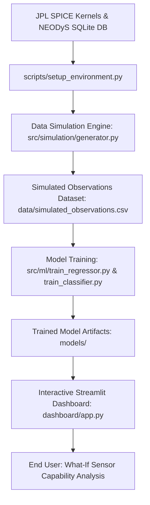

# ✨ NEO Detection ML Project

An end-to-end orbital mechanics simulation and machine learning pipeline for **Near-Earth Object (NEO) Detection Simulation, Photometry Analysis, and "What-If" Instrument Capability Forecasting**. 

This repository leverages NASA JPL SPICE kernels, Keplerian orbital equations, the official IAU H-G photometric system, and Ensemble Decision Trees to predict asteroid apparent magnitudes and dynamic detection probabilities under varying sensor payloads and observation conditions.

---

## 🧭 Project Architecture Overview



---

## 🛠️ Codebase Structure

The codebase is highly modular, separating physical equations, simulation pipelines, training orchestrators, and the user interface:

- `src/physics/`
  - `constants.py`: Holds fundamental values like the Heliocentric gravitational constant ($G M_{\odot} \approx 1.327 \times 10^{11} \text{ km}^3/\text{s}^2$) and astronomical units in km ($1 \text{ AU} \approx 1.496 \times 10^8 \text{ km}$).
  - [orbit.py](file:///c:/Users/acer/Desktop/NEOv2/neo_ml_project/src/physics/orbit.py): Wraps NASA's SPICE toolkit to perform Keplerian element state transitions (`spiceypy.conics`) and resolve Earth/Sun vectors.
  - [photometry.py](file:///c:/Users/acer/Desktop/NEOv2/neo_ml_project/src/physics/photometry.py): Computes visual phase angles, reduced magnitudes, and apparent magnitudes using H-G photometry equations.
- `src/simulation/`
  - [generator.py](file:///c:/Users/acer/Desktop/NEOv2/neo_ml_project/src/simulation/generator.py): Simulates observation schedules, performs vector operations, applies instrument constraints, and determines visibility.
  - [loader.py](file:///c:/Users/acer/Desktop/NEOv2/neo_ml_project/src/simulation/loader.py): Queries the SQLite database, performs cleaning (skips known anomalies), and handles SPICE kernel setups.
- `src/ml/`
  - [preprocessing.py](file:///c:/Users/acer/Desktop/NEOv2/neo_ml_project/src/ml/preprocessing.py): Loads simulated CSV files and handles NaN cleanup for regression and classification vectors.
  - [models.py](file:///c:/Users/acer/Desktop/NEOv2/neo_ml_project/src/ml/models.py): Defines Random Forest wrappers for apparent magnitude prediction and detection probability.
  - [train_regressor.py](file:///c:/Users/acer/Desktop/NEOv2/neo_ml_project/src/ml/train_regressor.py): Script to train and evaluate the magnitude estimator.
  - [train_classifier.py](file:///c:/Users/acer/Desktop/NEOv2/neo_ml_project/src/ml/train_classifier.py): Script to train and evaluate the binary visibility classifier.
- `scripts/`
  - [setup_environment.py](file:///c:/Users/acer/Desktop/NEOv2/neo_ml_project/scripts/setup_environment.py): Orchestrates kernel downloads and SQLite database initialization from the SpaceDyS servers.
  - [create_mock_db.py](file:///c:/Users/acer/Desktop/NEOv2/neo_ml_project/scripts/create_mock_db.py): Generates synthetic Keplerian elements in case of download failure or offline workflows.
  - [generate_data.py](file:///c:/Users/acer/Desktop/NEOv2/neo_ml_project/scripts/generate_data.py): Script generating observation records under 8 distinct FOV-Exposure scenarios.
  - [generate_varied_data.py](file:///c:/Users/acer/Desktop/NEOv2/neo_ml_project/scripts/generate_varied_data.py): Alternately simulates structured dataset buckets.
- `dashboard/`
  - [app.py](file:///c:/Users/acer/Desktop/NEOv2/neo_ml_project/dashboard/app.py): The Streamlit interactive interface.

---

## ⚙️ Mathematical & Physical Modeling (Development Process)

This project simulates complex physical, optical, and hardware behaviors by integrating three key mathematical domains:

### 1. Ephemeris & Orbital Mechanics (SPICE Integration)
Asteroids are loaded with Keplerian parameters at an initial epoch MJD. To find coordinates at any given date, the engine:
1. Obtains the asteroid state vector relative to the primary body (the Sun) at Ephemeris Time ($ET$) using analytical conics:
   $$\vec{r}_{NEO} = \text{conics}([r_p, e, i, \Omega, \omega, M_0, T_0, \mu_{Sun}], ET)$$
2. Obtains Earth's heliocentric position state vector $\vec{r}_{Earth}$ by querying JPL planetary ephemeris kernel (`de432s.bsp`) using:
   $$\vec{r}_{Earth} = \text{spkgps}(targ=399, et=ET, ref=\text{"ECLIPJ2000"}, obs=10)$$
3. Computes the geometric vector from Earth to the NEO ($\vec{r}_{E\rightarrow N} = \vec{r}_{NEO} - \vec{r}_{Earth}$) to derive observational range $d_{obs}$ and coordinates (Right Ascension $\alpha$, Declination $\delta$) using:
   $$[\text{range}, \alpha, \delta] = \text{recrad}(\vec{r}_{E\rightarrow N})$$

### 2. Visual Photometry (The H-G System)
The apparent visual magnitude $V$ of an asteroid is modeled using the official IAU H-G Photometry System:
$$V = H + 5\log_{10}(d_{obs} \cdot d_{ill}) - 2.5\log_{10}\left[(1-G)\Phi_1(\beta) + G\Phi_2(\beta)\right]$$

Where:
* $H$ is the asteroid's absolute magnitude (visual brightness at 1 AU from Sun & Earth at zero phase angle).
* $G$ is the slope parameter (regulating brightness variation with phase angle; typically $0.15$).
* $d_{obs}$ is the Earth-NEO distance, and $d_{ill}$ is the Sun-NEO distance in AU.
* $\beta$ is the phase angle (Sun-Asteroid-Earth angle), computed via:
  $$\beta = \arccos\left(\frac{\vec{r}_{NEO\rightarrow Earth} \cdot \vec{r}_{NEO\rightarrow Sun}}{\|\vec{r}_{NEO\rightarrow Earth}\| \|\vec{r}_{NEO\rightarrow Sun}\|}\right)$$
* $\Phi_1(\beta)$ and $\Phi_2(\beta)$ are the primary phase functions:
  $$\Phi_i(\beta) = \exp\left(-A_i \cdot \tan^{B_i}\left(\frac{\beta}{2}\right)\right)$$
  *(Constants: $A_1=3.33, B_1=0.63$ and $A_2=1.87, B_2=1.22$)*

### 3. Sensor SNR & Pointing Simulation (Telescope Payloads)
The engine simulates camera properties using physical limits:
1. **Effective Limiting Magnitude**: Long exposures collect more photons. The visual threshold gains $\approx 1.25$ magnitudes for every tenfold increase in exposure time due to the Signal-to-Noise Ratio (SNR) scaling:
   $$\text{Effective Limiting Magnitude} = \text{Base Magnitude Limit} + 1.25\log_{10}\left(\frac{\text{Exposure Time (s)}}{30.0}\right)$$
2. **Pointing Constraint (In-Frame)**: A synthetic pointing offset ($\theta_{offset}$) relative to the camera center is modeled. An asteroid is within the camera's frame only if its separation is less than half the FOV:
   $$\text{in\_frame} = 1 \iff \theta_{offset} \le \frac{\text{FOV (deg)}}{2}$$
3. **Detection Rule**: An object is marked as detected only if it is positioned inside the frame AND its visual apparent magnitude is brighter than the sensor threshold:
   $$\text{is\_detected} = 1 \iff \text{in\_frame} = 1 \land V \le \text{Effective Limiting Magnitude}$$

---

## 📊 Dataset in Numbers (Descriptive Statistics)

The combined simulation generated a robust observational matrix designed to cover a wide spectrum of physical orbits, sensor settings, and geometrical positions.

* **Total Simulated Observations**: **$292,800$ records**
* **Dataset Shape**: 292,800 rows × 19 columns
* **Columns list**: `neo_id`, `a` (semimajor axis), `e` (eccentricity), `i` (inclination), `H` (absolute mag), `distance_au` (observer range), `phase_angle_deg`, `ra_deg`, `dec_deg`, `limiting_mag` (base), `exposure_s`, `fov_deg`, `eff_limiting_mag` (calculated limit), `in_frame`, `off_axis_angle_deg`, `apparent_magnitude` (actual $V$), `is_detected` (label), `timestamp_utc`.

### 1. Severe Detection Class Imbalance (`is_detected`)
Because asteroids are seldom in frame and often too faint, the target label shows a highly representative astronomical sparsity:
* **0 (Undetected / Missed)**: **$261,594$ observations ($89.34\%$)**
* **1 (Detected / Visible)**: **$31,206$ observations ($10.66\%$)**

### 2. Apparent Magnitude Statistics ($V$)
The distribution of simulated apparent magnitudes demonstrates high variance, encompassing highly accessible objects to extremely dark minor planets:

| Statistic | Apparent Magnitude Value ($V$) | Description |
| :--- | :---: | :--- |
| **Minimum** | `14.19` | Extremely bright near-Earth flybys |
| **25% Percentile** | `22.15` | Readily observable by deep ground surveys |
| **Median (50%)** | `25.00` | Limits of standard astronomical instrumentation |
| **Mean** | `25.40` | Average simulated magnitude |
| **75% Percentile** | `28.48` | Highly challenging targets (requires space-based systems) |
| **Maximum** | `64.07` | Faint, distant targets behind the sun |
| **Std Dev** | `4.40` | Wide photometric dispersion |

---

## 🧠 Machine Learning Model Architectures

Instead of running slow numerical integration and vector equations, the project trains two Random Forest estimators to act as **real-time inference surrogates** for the physical pipeline.

### Feature Vectors
Both models take an identical $13$-dimensional feature matrix:
$$\mathbf{X} = [a, e, i, H, d_{obs}, \beta, \alpha, \delta, \text{base\_limiting\_mag}, \text{exposure\_s}, \text{fov\_deg}, \text{eff\_limiting\_mag}, \text{in\_frame}]$$

### 1. Apparent Magnitude Regressor (`RandomForestRegressor`)
* **Task**: Predicting visual apparent magnitude ($V$).
* **Hyperparameters**: 100 decision trees, unrestricted depth, parallel fitting (`n_jobs=-1`).
* **Training Methodology**: 80/20 random train/test split.
* **Evaluation Metrics**: Logs Mean Absolute Error (MAE) and Root Mean Squared Error (RMSE) on out-of-sample data.

### 2. Dynamic Visibility Classifier (`RandomForestClassifier`)
* **Task**: Estimating probability of discovery / detection ($P(\text{detected})$).
* **Hyperparameters**: 100 decision trees, unrestricted depth, parallel fitting.
* **Class Weight Strategy**: Implements `class_weight="balanced"` to dynamically adjust tree weights inversely proportional to class frequencies. This prevents bias towards the dominant $89\%$ negative class.
* **Evaluation Metrics**: Logs Stratified Accuracy, Precision, Recall, F1 Score, and ROC-AUC score.

---

## 💻 Tech Stack & Libraries

* **Core**: Python (3.13)
* **Orbital Engine**: NASA SPICE Toolkit (`spiceypy` C-wrapper wrapper)
* **Data Processing & Analytics**: Pandas (vectorized operations), NumPy (linear algebra and vector normals), SQLite3 (local DB processing)
* **Surrogate ML Engine**: Scikit-Learn (Ensemble modeling & evaluation), Joblib (Model persistence)
* **Visualization**: Matplotlib, Seaborn, Plotly Express
* **Application Framework**: Streamlit (Reactive component state management)

---

## 🚀 Step-by-Step Installation & Run Guide

### 1. Clone & Setup Workspace
First, make sure all Python dependencies are present:
```bash
pip install -r requirements.txt
```

### 2. Bootstrap Astronomical Environment
Run the setup utility to fetch planetary SPICE kernels from NASA JPL and download/build the NEODyS SQLite database:
```bash
python scripts/setup_environment.py
```
*(If offline or blocking exists, you can fall back to creating a mock database immediately using `python scripts/create_mock_db.py`)*

### 3. Generate Simulated Observational Datasets
Generate observations spanning varied sensor properties to build training examples:
```bash
python scripts/generate_data.py --neos 500 --start 2026-01-01 --end 2026-06-01 --step-hours 24
```

### 4. Train surrogate Models
Run the training scripts for the Regressor and the Classifier:
```bash
# Train Apparent Magnitude estimator
python src/ml/train_regressor.py

# Train Visibility classifier
python src/ml/train_classifier.py
```
*Trained model artifacts will be saved into the `/models/` directory.*

### 5. Launch interactive What-If Dashboard
Run the Streamlit frontend application:
```bash
streamlit run dashboard/app.py
```
The app will open locally at **[http://localhost:8501](http://localhost:8501)**, allowing you to select observation dates, drag camera exposure and field-of-view sliders, and see instant updates on celestial sky maps and detection accuracy.
